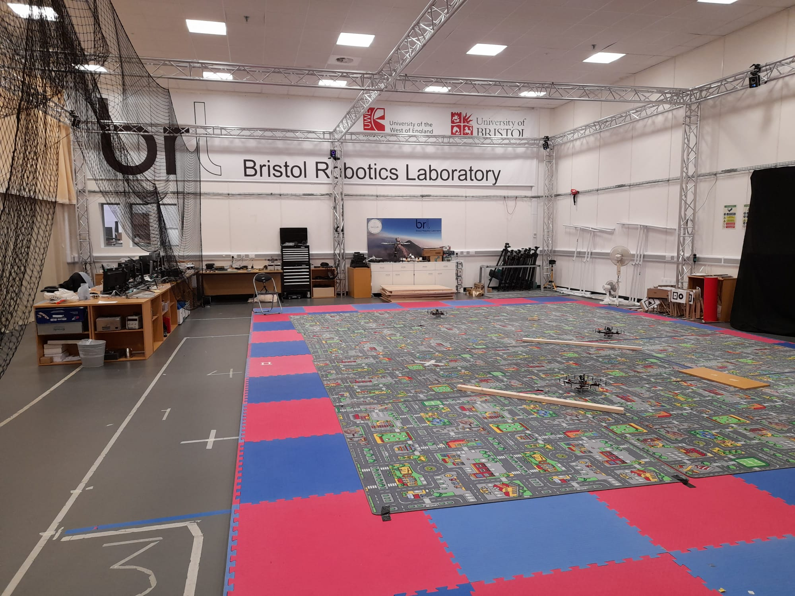
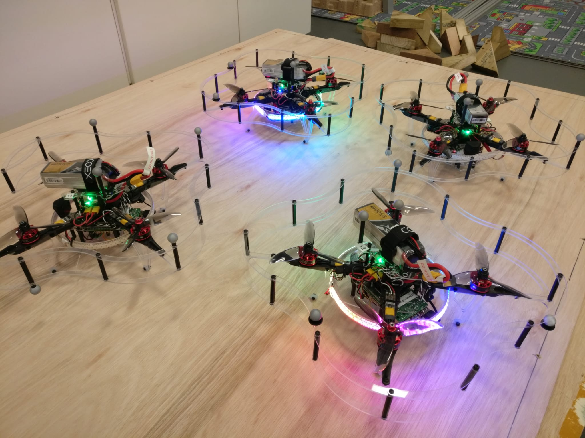
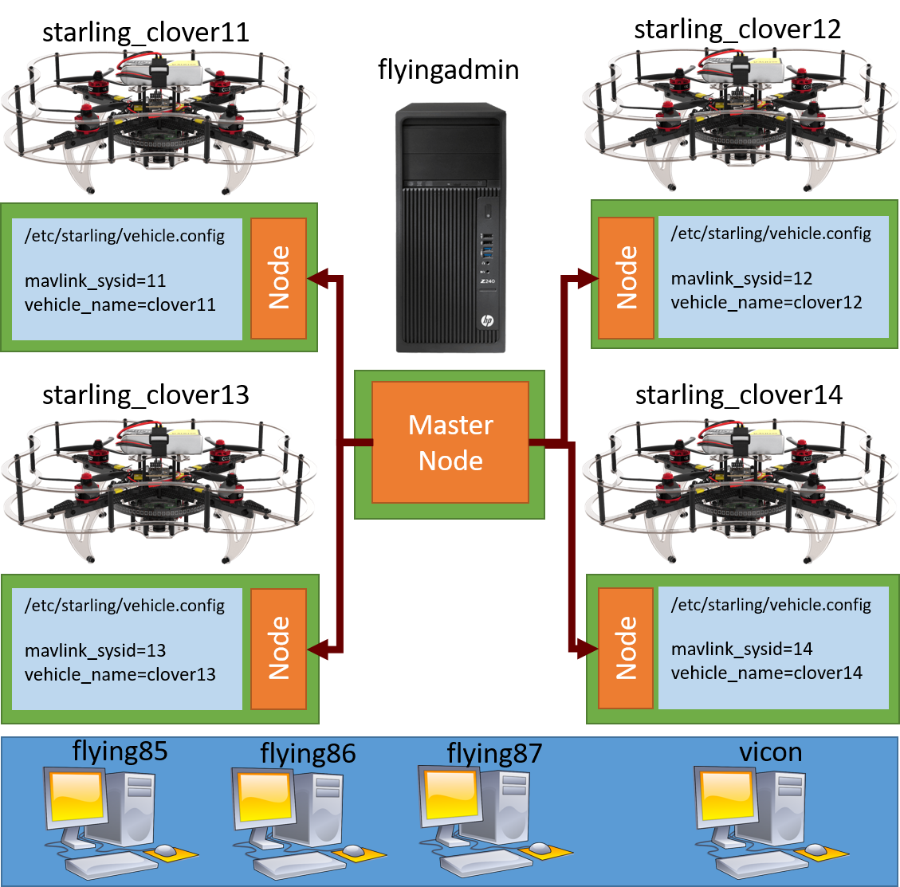

# Flying your controllers in the Flying Arena

Now we reach the final step, running your controllers on the real vehicles. By the end of this tutorial you should hopefully be able to understand how to transition from flying with your KinD integration testing stack to the real world - well more specifically the Bristol Robotics Laboratory flight arena.

[TOC]

## Bristol Robotics Laboratory Flight Arena

The Bristol Robotics Lab (BRL) Flight Arena is a large 15.6m x 11.8m x 5m space with a large 10m x 5m x 4m flying volume in the center.



### Flight Arena Features

The space is safe to fly vehicles up to 5kg, and multiple smaller vehicles. In the past we've had projects ranging from high speed flight for autonomous drone racing to flying custom drones for cave inspections.

A key feature of the flight arena is the array of ViCon Motion Capture cameras dotted around the gantries. When calibrated, these give mm level accuracy at detecting the position of reflective balls. These balls are placed in a non-symmetric pattern aroound the UAV. This allows us to have excellent positioning information of our drones and is fed directly to the vehicle.

For multi-uav work, we have aquired a set of [coex clover](https://coex.tech/clover) multirotor UAVs. These UAVs are comprised of a raspberry pi 4B with 2Gb RAM connected to a modified PixRacer Autopilot running PX4. For sensing, they have your standard set of IMU, magnetometer, compass and barometer, as well as a downwards facing range finder, a camera, and a ring of LEDs. These clovers are the ones we aim to do our application tests on.



In terms of compute, we have 3 recent desktops and 2 laptop hotdesking spaces, and an arena server. For networking, we rely on a strong wifi hub to transmit to and from any active vehicles.

### Flight Arena System Setup

Currently in the flight arena we have a minature cluster setup using a lightweight variant of kubernetes known as [k3s](https://k3s.io/). We opt to use k3s as it provides many of the core features we require from running kubernetes, without beeing needlessly expensive to run on low-powered edge hardware.



As shown in the diagram, we run a central k8 server on the arena server. Each of the vehicles is then setup as a node with a name of clover11 to vehicle14. These can be seen by logging onto any of the machines and going to the arena kubernetes dashboard on `https://flyingserver.local:13771`. You will need to run `starling utils get-dashboard-token` to get the access token.

Each vehicle is identified by its hostname (`startling_cloverXX`) on the network, as well as by its unique `/etc/starling/vehicle.config`. This file is created on drone setup and contains a unique system id to talk to the autopilot with and the name of the vehicle.

Each of the desktop machines only serve to access the cluster and are not part of the cluster themselves. However due to a quirk of ROS2, each of the desktops can actually natively (and through running a docker container) access the active ROS2 topics.

A useful side-affect of running the drones as nodes in a cluster is that they do not need reconfiguring on startup. Once a vehicle is turned on it will automatically attempt to reconnect to the cluster and request its deployed containers.

A key element of indoor flight, especially so with multiple vehicles, is safety. It is absolutely paramount that we are always aware of the safety cases and features of anything we fly - hence the need for this entire testing and integration testing stack in the first place.

### Default deployments

Just like in the integration test, by default we have the following deployments

- Every 'vehicle' has the MAVROS container deployed to it.
- Every 'clover' (a type of UAV we are using) has the Clover Hardware Container deployed to it.
- Every 'multirotor' has the User's onboard controller deployed to it.
- The offboard, gui and safety monitor are restricted to only be deployed on the 'master' node.


## Preparing your controller for real world deployment

### Pushing your image to Docker Hub

On a deployment, the individual drones are set to query and pull the required images from docker hub. Therefore it is necessary to push a build of your image to docker hub.

> *Note:* In the future it will be possible to load to a registry on the local network, but as of writing it is not yet been setup.

If you have not yet made a docker hub account, now is the time. Make sure you match the account name that you created your starling project with, otherwise it will be a hassle to change it. Once created, you will also need to login on with your username and password on your local machine.

```console
docker login
```

Once you have logged in, you should have the ability to push your built project's image up to Docker Hub. You can try this now with.

```bash
docker push <docker_hub_username>/<my_image_name>
# e.g
docker push starling123/starling_template_test
```

### Building and pushing for arm64

Unfortunately you cannot actually run the image you just pushed to docker hub on the Raspberry Pis running on the Clovers. This is because they run the *arm64* computer architecture, compared to the *amd64* architecture you are likely running on your development machine.

By default, your machine builds the image which matches your machine. In order to build an *arm64* image locally, you will have to cross-compile it. This involves starting up a *arm64* emulator (called qemu) and building your image within that environment.

> *Note:* You could also just git pull and make the project on a spare rapsberry pi or other arm64 archtected device too.

We have usefully set these actions up in your makefile. To initialise the cross-compilation, run:

```bash
make local-build-setup
```

This might take a minute, as it needs to pull an emulation container and other things. Once finished, you can cross-compile the images for both amd64 and arm64 simultaneously using:

```bash
make local-build-push
```

> *Note:* The initial build can take a LONG time (from 10 to 30 minutes). Thankfully further builds are mostly cached so they take between 3 to 8 minutes.

> *Note:* For heavy onboard or sensor related development, it is recommended to use the VSCode remote development tools to develop inside a container on the raspberry pi.

Once complete, you can verify that the container has been pushed by visitng your docker hub account and hopefully seeing it there.

Due to the long build times, it is recommended you analyse and verify as much as you can offboard to ensure that you only need to rebuild a minimal number of times.

## Deploying and Developing on real vehicles

Now that the container is ready, all thats left is readying the vehicles.

### Clover Procedures

1. Ensure the VICON motion capture cameras are on, and connected to the VICON capture application on the dedicated vicon machine.
2. Inspect the vehicle for physical damage, are all the screws in and tightened, are all the wires fixed and out of the way of the blades.
3. Ensure that the correct 14.8v, 4 cell Series batteries are fully charged using the battery tester.
4. Ensure that all the nets are lowered in the flight arena, and that all other people have vacated the flight volume.
5. Place the vehicle within the flight volume, secure the battery to the top of the vehicle using the velcro, and plug in the battery. The vehicle should beep indicating it has power and is turning on.
6. Leave the flight volume to check on vehicle status.

At this point you should go to the kubernetes dashboard and double check the status of the containers on the vehicle. If the vehicle has succesfully started, the ring of LEDs should turn solid blue with no blinking. This indicates that the vehicle has initialised and that it is receiving state information from the MAVROS container.

A couple of things to be aware of:

- It can take up to 5 minutes for the vehicle to start up, connect to the network, update its containers and start running.
- On startup, periodically go to the nodes page and see if has connected (shows green dot). It is possible that one or more of the containers have failed on startup and require restarting. Restart a container simply by deleting it.
- If a vehicle is stuck on blinking blue light for a while, this indicates that the vehicle monitor cannot find MAVROS. In this instance you should restart the vehicle.
- To restart the vehicle, there is a push button stuck to the ethernet port. Press this button and count to 10 to shutdown the raspberry pi. Then you can disconnect the battery to either replace, or (count to 3), then plug it back in.

<span style="color:red">You must always be aware of safety. Familiarise yourself with the safety equipment and procedures of the flight arena. In particular what to do in the event of a lipo fire or severe UAV crash. If in doubt, contact your supervisor to arrange for somebody to be there during your testing.</span>


### Deploying your controllers

The procedure for deployment is identical to the integration testing (by design! :-) ). First ensure that the cluster state is correct, you don't have any extra containers or other peoples applications containers running. Verify only the core deployments and daemonsets are applied. Once ready you can deploy your application:

```bash
starling deploy -f deployment/kubernetes.yaml start
```

> *Note:* As the vehicle pulls directly from docker hub, there is no need for `--load`.

Once deployed, you can verify the state of your deployment on kubernetes dashboard.

As a testing procedure, it is always recommended that you verify that your controller displays the correct behaviour for 1 vehicle first, followed by multiple vehicles. It is simpler and easier to keep an eye on if something goes wrong.

> *Note:* Verify that the vehicle is showing up on Vicon and is stable. Also verify that the internal positioning is stable and correct by using one of the machines to run `ros2 topic echo /vehicle_XX/mavros/local_position/pose`. Either run on the lab machine, or start a docker container with `docker run -it --rm --net=host uobflightlabstarling/starling-mavros bash`, followed by `. /opt/ros/foxy/setup.bash` to give you access to the ros cli.

Once you are happy that the controllers are working as intended, the flight procedure is the following:

1. Announce that you are about to fly.
2. Stand up holding the arena controls with hands ready to either abort or hit the emergency stop button.
3. Press the GO button. (The vehicle will take-off)
4. Verify the start location, Press the GO button. (The vehicle will go to the start location)
5. Verify in the correct state, Press the GO button. (The vehicle will start executing your UserController)

If everything works great then you will have two drones flying around in a nice circle.


If not, you should make your change, verify in simulation, cross-compile and push to docker hub, then deploy your changes by restarting the deployment with:

```bash
starling deploy -f deployment/kubernetes.yaml restart
```

To stop or tidy up, turn off the drones and return the batteries to the fireproof bags. Put away the drones onto the shelf and turn off the Vicon cameras and dedicated machine. Turn off the battery charging equipment and then the lights.

## Next Steps

Awesome, now you've flown in real life! By the end of this final tutorial, you should now have an understanding of how real life flight looks like within Starling. In particular you should know how Starling has been setup within the BRL flight arena, how to build and deploy for the clover drones, how to prepare them for flight and finally how to deploy your controllers to it to fly.

Join us in the last section for a quick wrap up of the tutorial.